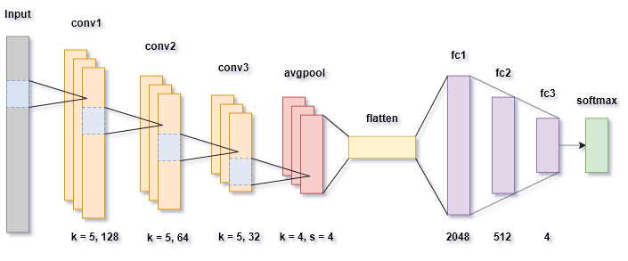

# Soccer Action Classification

Action classification and retrieval of soccer videos using <a href="https://soccer-net.org/">SoccerNet-V2 dataset</a>.

For the classification task we have chosen to work on 4 of the 17 available in the dataset.

| Classes        | # examples    |
| -------------- |:-------------:|
| Goal           | 1531          |
| Foul           | 4483          |
| Corner         | 3775          |
| No Action      | 4490          |
| Total          | 14279         |

An accurate description of the project could be found into the [project description document](project_description.pdf)

## Classification

### Architecture

The architecture of the network is is composed by a Feature Extractor and a Classifier:

- <b>Feature Extractor:</b> Is a ResNet18 without the classification layer and the global AVG Pooling

- <b>Classifier:</b> 1D CNN with 3 convolutional layers and 3 fully-connected one.


The training is done only on the Classifier, while the Feature Extractor is pre-trained on ImageNet.

### Usage

To train/test the classification task run the following command:

```console
python NeuralNet/classification.py [-l learning_rate(float)  | -w weight_decay(float) | -p patience(int) | -a avgpool (0 or 1) | -e]
```

| Parameter      | Requires value   | Description   | Deafult  |
| -------------- |:-------------:|:-------------:|:-------------:
| l              | Yes           | Learning rate used by the optimizer          | 0.00001 |
| w              | Yes           | Weight decay used by the optimizer          | 0 |
| p              | Yes           | Num. of epochs of patience. To finish the training we wait p epochs in which there is no improvement in terms of validation accuracy         | 5 |
| a              | Yes            | If 1 an AvgPool layer of kernel size 2 is added at the end of the ResNet         | 0 |
| e              | No             | Extract descriptors to use for Action Retrieval on the test set         |


If it already exists a trained model with the input parameters, the code will load the weights from that model, and no training will be necessary.

